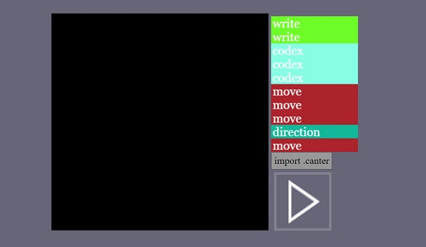

# canter
Import a .canter file from [neodna](https://github.com/adamlater/neodna), and display the resulting image.

In [neodna](https://github.com/adamlater/neodna), a DNA sequence becomes an image by converting words ( ie. 00, 01, 10, 11 or ACGT ) into basic commands which instruct a pixel to move around a canvas, creating a picture, changing variables and interacting with other data.

A simple library of functions for this program might be:  
**code__move**       ( move by 1 pixel in the current direction )  
**code__write**      ( write 1 pixel )  
**code__direction**  ( change direction of facing by 90 degrees )  
**code__origin**     ( return to 0, 0 or x, y )  
**code__codex**      ( change to the adjacent codex [ a set of functions ] )  

By running the sequence over the library, a program is created ( in [neodna](https://github.com/adamlater/neodna) this is a canteroll, which has .canter format ).

## The canteroll
The canteroll is as long as the original sequence, and can be used to represent the original sequence graphically. Important features are that it does not contain the original sequence and can be difficult to reverse without the underlying library which helped create it. By running a DNA sequence over a library of functions, small sequences can create very large programs which create complex images, and **character**.

This program will allow you to view a single .canter file in slow-motion as it runs through it's sequence.
